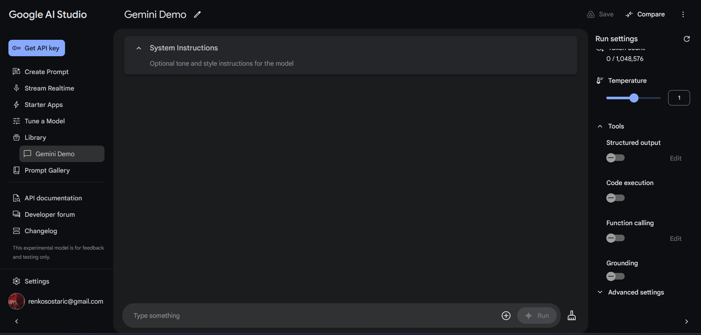
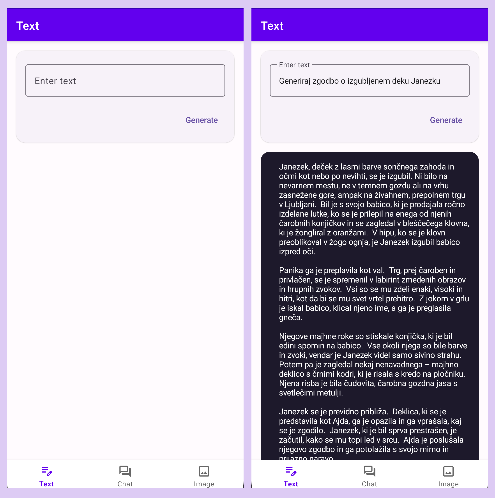
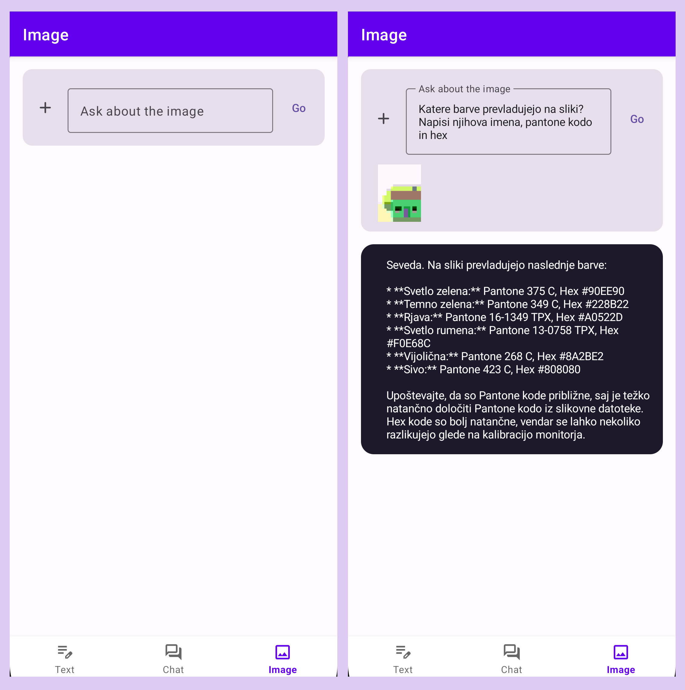
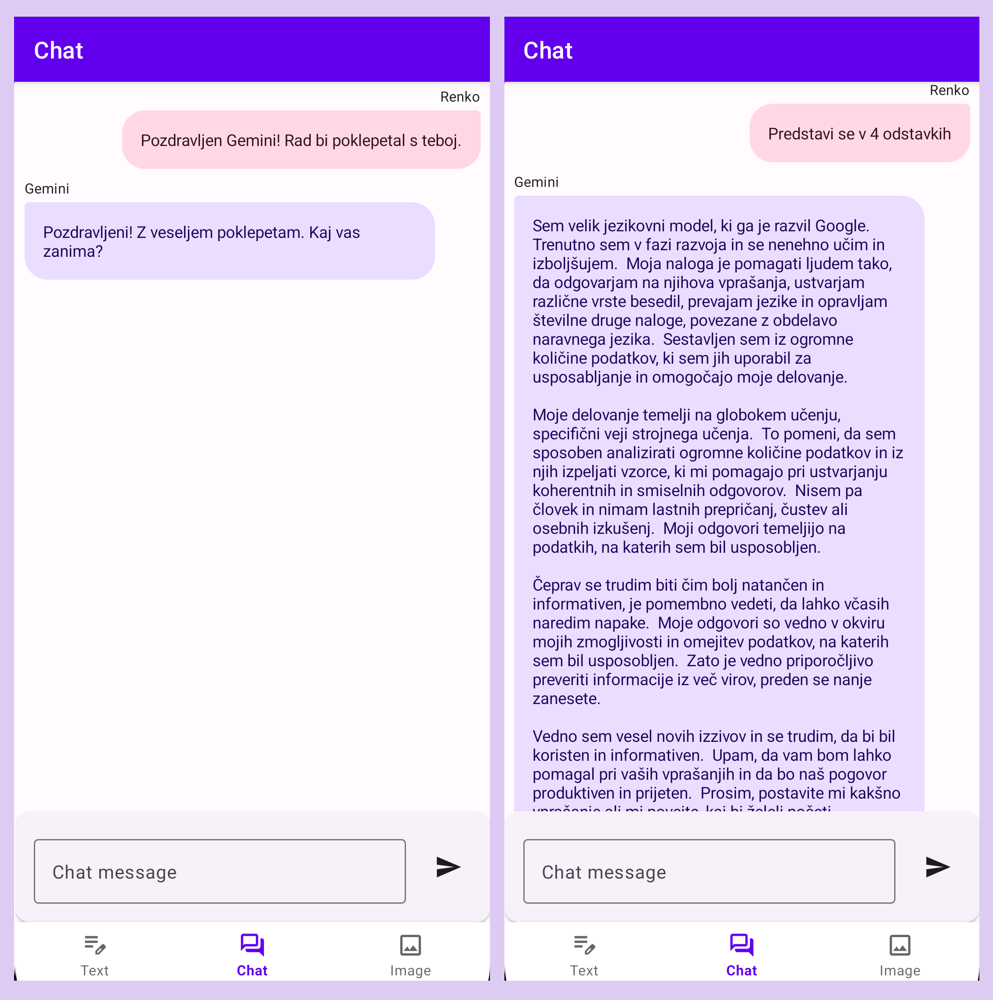
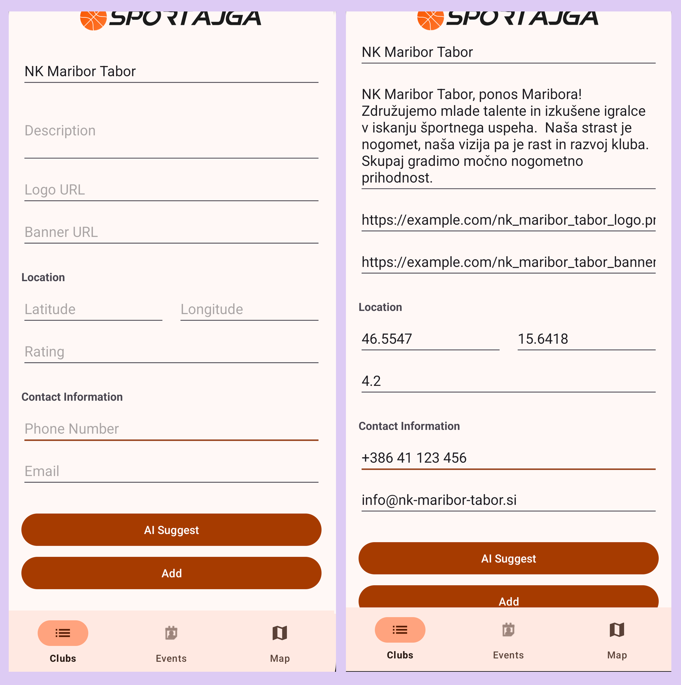

# 🤖 Google Gemini API

Google Gemini API je programski vmesnik (API), ki omogoča dostop do Google-ovega najnaprednejšega jezikovnega modela. Gemini lahko generira besedilo, analizira slike, pomaga pri pisanju kode in opravlja številne druge naloge umetne inteligence. API je na voljo preko Google-ove platforme AI Studio ali preko različnih programskih knjižnic za različne programske jezike.

## 📖 Google AI Client SDK za Android

Google AI Client SDK za Android je uradna knjižnica, ki poenostavi razvoj AI funkcionalnosti v Android aplikacijah. Razvijalcem ponuja številne prednosti:
- **Upravljanje zahtev**: Abstrakcija in avtomatizacija HTTP komunikacije ter klicev
- **Sprotno procesiranje**: Streamanje odgovorov v realnem času z možnostjo takojšnjega prikaza generiranih vsebin
- **Procesiranje slik**: Podpora za enostavno uporabo multimodalnega konteksta z fotografijami
- **Pogovorni vmesnik**: Namenske funkcije za implementacijo AI Chat
- **Lokalno izvajanje**: Podpora za procesiranje operacij neposredno na napravi (Gemini Nano + Gemini Edge SDK)

## ✅ Prednosti
- Preprosta implementacija osnovnih funkcionalnosti (Text Generation, Image Reasoning, AI Chat)
- Podpora za Kotlin Coroutines in Flow
- Poskrbi za tipe in error handling 
- Fleksibilnost pri izbiri modelov in konfiguraciji

## ❌ Slabosti
- Mišljeno samo za prototipiranje in ekperimentiranje (za produkcijo Vertex AI in Firebase)
- Omejena količina dokumentacije specifične za Android
- Manjkajoča napredna orodja (structured output in grounding)

## 📜 Licenca
Google AI Client SDK za Android je na voljo pod **Apache License 2.0**, kar omogoča:
- Prosto uporabo knjižnice
- Možnost modifikacije
- Komercialno uporabo
- Vključevanje v lastne projekte

Uporaba Gemini modelov preko Gemini API pa ima svoj cenik:

| Model                | Brezplačna različica                                             | Plačljiva različica                                                                |
|----------------------|------------------------------------------------------------------|------------------------------------------------------------------------------------|
| **Gemini 1.5 Flash** | • 15 zahtev/minuto<br>• 1.5k zahtev/dan<br>• 1mil žetonov/minuto | • $0.075/1M vhodnih žetonov<br>• $0.30/1M izhodnih žetonov<br>• 2000 zahtev/minuto |
| **Gemini 1.5 Pro**   | • 2 zahtevi/minuto<br>• 50 zahtev/dan<br>• 32k žetonov/minuto    | • $1.25/1M vhodnih žetonov<br>• $5.00/1M izhodnih žetonov<br>• 1000 zahtev/minuto  |
| **Gemini 1.0 Pro**   | • 15 zahtev/minuto<br>• 1.5k zahtev/dan<br>• 32k žetonov/minuto  | • $0.50/1M vhodnih žetonov<br>• $1.50/1M izhodnih žetonov<br>• 360 zahtev/minuto   |

> Opomba: Cene so za prompte krajše od 128K tokenov, za daljše so cene 2x višje

## 📊 Statistika
[](https://github.com/google/generative-ai-android/stargazers)
[](https://github.com/google/generative-ai-android/network/members)
[](https://github.com/google/generative-ai-android/watchers)

## 🛠️ Vzdrževanje
Projektu so večinoma kontributirali Google zaposleni, nazadnje avgusta 2024.

[](https://github.com/google/generative-ai-android/graphs/contributors)
[](https://github.com/google/generative-ai-android/commits/main)
[](https://github.com/google/generative-ai-android/issues)

Velik kontrast med Android SDK in novim Python Google Gen AI SDK...
[](https://github.com/googleapis/python-genai/commits/main)

## 💡 Primeri uporabe
### Google AI Studio
Prototipiranje promptov in generacija API ključev



### Integracija v Android aplikacijo
app/build.gradle.kts
```gradle
dependencies {
    implementation("com.google.ai.client.generativeai:generativeai:0.9.0")
}
```

### Shranjevanje API ključa
app/build.gradle.kts
```gradle
plugins {
    id("com.google.android.libraries.mapsplatform.secrets-gradle-plugin")
}

buildFeatures {
    buildConfig = true
}
```

local.properties
```properties
apiKey=your_api_key_here
```

### Ustvarjanje objekta modela
```kotlin
val generativeModel = GenerativeModel(
    modelName = "gemini-1.5-flash",
    apiKey = BuildConfig.apiKey
)
```

### Generacija besedila
```kotlin
val prompt = "Napiši zgodbo o Janezku izgubljenem dečku"
val response = generativeModel.generateContent(prompt)
```


### Multimodalni prompting
```kotlin
var prompt = "Kaj vidiš na slikah?"
val inputContent = content {
    for (bitmap in selectedImages) {
        image(bitmap)
    }
    text(prompt)
}
val response = generativeModel.generateContent(inputContent)
```


### AI Chat
```kotlin
val history = listOf(
        content(role = "user") { text("Pozdravljen Gemini! Rad bi se pogovarjal.") },
        content(role = "model") { text("Pozdravljeni! Z veseljem poklepetam. Kaj vas zanima?") }
    )
val chat = generativeModel.startChat(history)

val message = "Kera žival ne mara vrtnih lop?"
val response = chat.sendMessage(userMessage)
```


### Streaming
```kotlin
class ChatViewModel : ViewModel() {
    private val generativeModel = GenerativeModel(
        modelName = "gemini-1.5-pro",
        apiKey = BuildConfig.GEMINI_API_KEY
    )
    private val chat = generativeModel.startChat()
    
    private val _responseFlow = MutableStateFlow<String>("")
    val responseFlow = _responseFlow.asStateFlow()

    fun sendMessage(message: String) = viewModelScope.launch {
        try {
            _responseFlow.value = ""
            
            chat.sendMessageStream(message).collect { chunk ->
                _responseFlow.value += chunk.text
            }
        } catch (e: Exception) {
            Log.e("ChatViewModel", "Error: ${e.message}")
        }
    }
}
```
#### Uporaba v UI za sprotno prikazovanje:
```kotlin
    lifecycleScope.launch {
        repeatOnLifecycle(Lifecycle.State.STARTED) {
            viewModel.responseFlow.collect { response ->
                binding.responseTextView.text = response
            }
        }
    }
```

## 🔧 Integracija v lastno aplikacijo

### JSON Schema
```kotlin
val clubName = "NK Maribor Tabor"
val prompt = """Make up a 4 lines long coherent description in slovenian for a sports club "$clubName". 
    Also try to find the logo_url, banner_url, latitude, longitude, rating, phone_number, email... You can make up missing data if you can't find it but make it believable. 
    
    use this JSON schema: {
    "description": "string",
    "logo_url": "string",
    "banner_url": "string",
    "latitude": "number",
    "longitude": "number",
    "rating": "number",
    "phone_number": "string",
    "email": "string"
    }

    Return ONLY the JSON without any additional text or markdown formatting.
    if you can't find any information for that specific field put an empty string or 0 for number fields and always put just one item per field"""

val response = model.generateContent(prompt).text
val suggestion = Gson().fromJson(response, ClubSuggestion::class.java)
```


